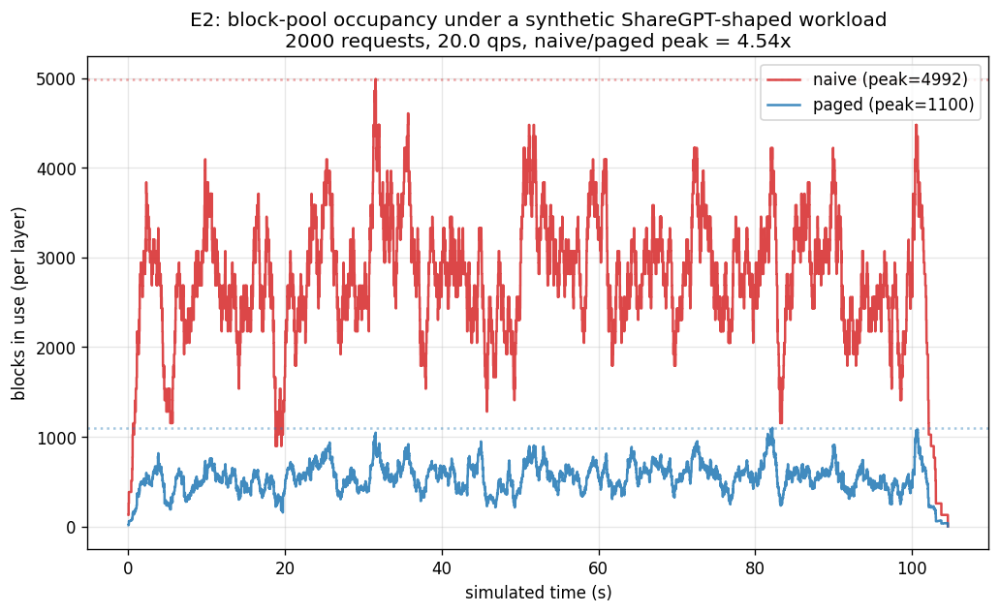
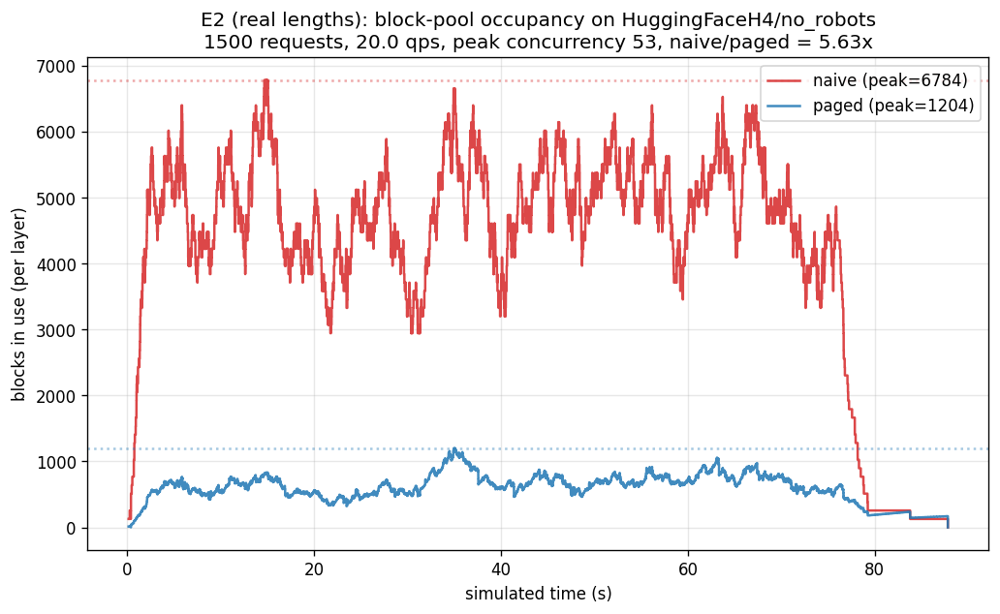
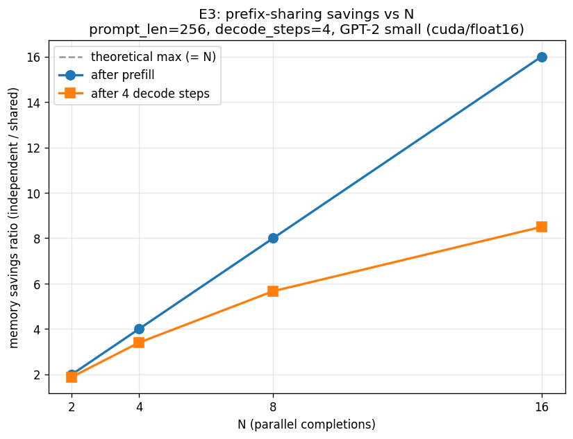
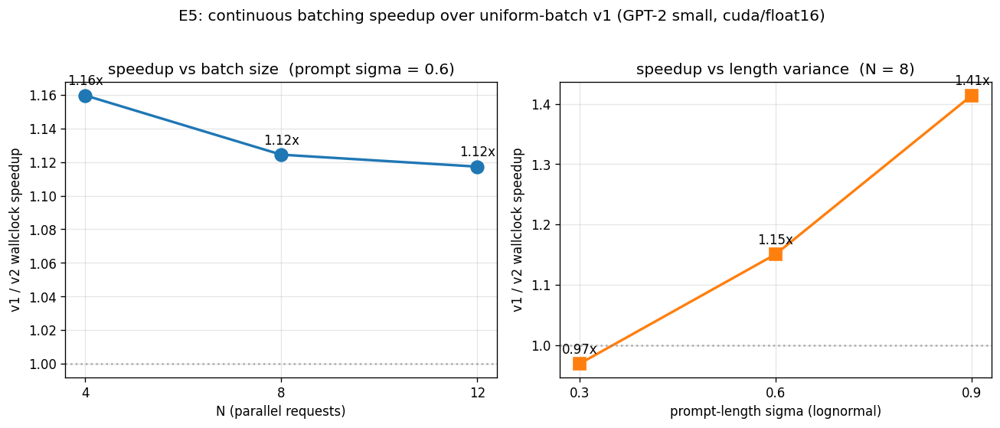

# MiniPageAttention

A teaching-scale reimplementation of the [PagedAttention](https://arxiv.org/abs/2309.06180)
runtime — block-paged KV cache, refcounted prefix sharing (copy-on-write),
iteration-level ("continuous") batching, and a paged-decode Triton kernel
modelled on vLLM's `paged_attention_v2` launcher. Everything is built around
GPT-2 small + HuggingFace `transformers`, so the full stack runs on a laptop CPU
(in fp32, slowly) or a single Colab GPU (T4/A100, fp16) with no other infra.

It accompanies the report in [`doc/report.tex`](doc/report.tex), *Three Layers of
LLM Inference: A Critical Reading of FlashAttention, Orca, and PagedAttention*.
The code exists so the report's critique is grounded in something that has to
confront the integration questions the original papers leave informal — the
report's §"The v2 launcher and what my implementation mirrors" maps the
correspondence line by line.

---

## How it fits together

```
                 transformers GPT-2 forward
                          │
        prefill (T>1)     │     decode (T==1)
   ┌──────────────────────┼───────────────────────┐
   │                      │                       │
PagedCache.update()       │        gpu/paged_attn_patch.py
  → writes K/V into       │          → append_only_decode()  (write 1 token)
    paged pool            │          → paged_attention_decode(q, k_pool, v_pool,
  → _gather() to          │                    block_tables, seq_lens, scale)
    [B,H,L,D]             │             (torch ref  |  Triton kernel)
  → stock HF attention    │
                          │
              ┌───────────┴────────────┐
        cpu/scheduler.py        cpu/continuous_scheduler.py
       (v1: lockstep batch)    (v2: requests join/leave per step)
                          │
                    serving/api.py  (FastAPI, wraps v2)
```

The `BlockManager` holds the physical storage; everything above only touches
*block tables* (per-sequence `List[int]` of physical block ids) and *lengths*.

---

## Components

### `paged_cache.py` — block pool + v1 paged cache

- **`BlockManager(n_layers, n_heads, head_dim, n_blocks, block_size, dtype, device)`** —
  the global pool. Storage is two tensors of shape
  `(n_layers, n_blocks, block_size, n_heads, head_dim)` (`k_pool`, `v_pool`).
  API: `allocate() -> bid`, `fork(bid) -> bid` (refcount++), `free(bid)` (refcount--,
  recycled at 0), `n_used`. Optional `on_alloc` / `on_free` hooks feed the E2
  fragmentation traces. Note this is the *simple* `[..., block, heads, head]`
  layout — vLLM's `[blocks, heads, head/x, block, x]` coalescing split is dropped
  because Triton tiles handle coalescing (see report §"Pointer plumbing and the `x` factor").
- **`PagedLayer`** — one layer's slice: per-sequence `tables` and `lens`.
  `update(K, V)` walks new tokens, allocates a fresh block at every `block_size`
  boundary, scatters K/V in, then `_gather()`s the live prefix back to a
  contiguous `[B, H, L, D]` for stock HF attention — i.e. it reproduces
  PagedAttention's *allocation* behaviour without (yet) a custom kernel.
  `append_only_decode(K, V)` is the kernel path: write one token, return
  `(block_tables, seq_lens)` and skip the gather. `build_metadata(batch_indices)`
  builds the `int32 [B, max_blocks]` (−1-padded) block-table tensor + `int32 [B]`
  seq-lens the kernel wants.
- **`PagedCache(Cache)`** — a `transformers` `Cache` made of `PagedLayer`s
  (uniform-batch only). `fork_prefix(src_cache, src_idx, dst_indices)` shares a
  prefilled prompt's blocks into N decode slots via `manager.fork()` (the prompt
  KV exists once regardless of N; output blocks stay per-sequence).
  `free_sequence(idx)` releases a slot's blocks.

### `continuous_cache.py` — variable-length cache

- **`ContinuousPagedCache`** / **`ContinuousPagedLayer`** — slots are addressed by
  index with explicit activate/deactivate. At any moment a subset is *active*
  (`set_active_indices(...)`) and that's what the next `model()` call operates on.
  Active slots can have *different* lengths; `_gather` returns `[B, H, max_L, D]`
  zero-padded for short slots, and the scheduler must propagate a per-row
  attention mask. Reuses the same `BlockManager`; refcounting / prefix forking work
  the same way.

### `cpu/` — schedulers

- **`scheduler.py` — `Scheduler` (v1)**: runs a `List[Request]` as one lockstep
  decoding batch through (HF model + `PagedCache`). Variable-length prompts are
  left-padded with EOS + an attention mask so the cache sees a uniform length.
  A sequence that finishes early keeps its slot (and gets discarded `model()`
  calls) until the longest one is done. Records `CompletedRequest`
  (TTFT, latency, output tokens); `aggregate_stats(...)` rolls those up.
- **`continuous_scheduler.py` — `ContinuousScheduler` (v2)**: iteration-level
  scheduling. Each step: one prefill `model()` call admits the next queued request,
  then one decode `model()` call advances every running sequence, with the cache's
  `active_indices` flipped between the two. Simplest correct continuous-batching
  design — not chunked prefill (which would mix prefill+decode in one forward).
- **`cpu/experiments/`** — `e1`–`e5` headline scripts + `plot_e2`, `plot_e2_real`,
  `plot_e3`, `plot_e5_sweep` figure generators (all `python -m ...` from root).

### `gpu/` — paged-decode kernel + GPT-2 patch

- **`paged_attention_kernel.py`** — `paged_attention_decode(q, k_pool, v_pool,
  block_tables, seq_lens, scale)` computes attention for a decode step *directly
  from paged memory* (no gather of the full sequence). Two backends share the
  signature: `paged_attention_decode_torch` (torch-native reference, the CPU
  sanity path) and `paged_attention_decode_triton` (Triton kernel: v1-style
  single-pass online softmax, one program per `(batch, head)`; autotuned over
  `num_warps × num_stages`). Signature mirrors the relevant arguments of vLLM's
  v2 launcher; FP8 KV, ALiBi, block-sparse, GQA scales, `tp_rank`, and the
  partition+reduce split are intentionally omitted.
- **`paged_attn_patch.py`** — `enable_paged_attention()` / `disable_paged_attention()`
  (or the `paged_attention(...)` context manager) globally patch
  `GPT2Attention.forward`: when it sees a decode step (`T==1`) on a paged cache
  (duck-typed via `.layers[0].append_only_decode`) and not cross-attention /
  `output_attentions`, it projects Q/K/V, appends K/V into the pool, and calls
  `paged_attention_decode`. Prefill (`T>1`) and non-paged caches fall through to
  unmodified HF.
- **`run_all.py`** — one-shot GPU runner. Reuses the device-agnostic classes with
  CUDA+fp16, loads GPT-2 once, runs **E1** (correctness), **E3** (prefix sharing),
  **E5** (v1 vs v2), **E6** (kernel parity vs the gather path), then regenerates
  the four report figures into `plots/` so figures and headline numbers come from
  the same run. `--no-plots` skips that. Falls back to CPU+fp32 with a warning.
- **`test_paged_kernel.py`** — synthetic harness: random paged pool + variable
  block tables, checks `torch` backend vs a gathered+masked naive reference vs the
  Triton backend (high precision in fp32, reasonable in fp16).

### `bench/` — workloads + measurement

- **`workloads.py`** — `Request(request_id, prompt_len, output_len, arrival_time,
  prompt_tokens)` plus generators: `synthetic_workload` (ShareGPT-fitted lognormal
  lengths + Poisson arrivals), `sharegpt_workload` (replays `bench/sharegpt_mock.json`),
  `hf_chat_workload` (streams real conversation lengths from a HF dataset — needs
  `datasets`), `shared_prefix_workload` (N requests, one prompt — for E3),
  `fixed_length_workload` (uniform — for E1/ablations).
- **`metrics.py`** — `simulate_allocator(...)` is the workhorse for E2: a
  discrete-event allocate/free model with **no** actual model, so a 10K-request
  sweep is seconds not hours. Also `AllocationTrace`, `LatencyStats`,
  `peak_concurrency`.

### `serving/api.py` — FastAPI server

Minimal synchronous wrapper over `ContinuousScheduler` (GPT-2 small,
`n_blocks=2048`, `block_size=16`). Endpoints: `GET /healthz`, `GET /`,
`POST /v1/completions` (`{"prompts": [...], "max_tokens": n}` → completions).
Concurrent HTTP requests are serialized via a lock — true async multi-tenant
serving (one running scheduler loop, requests joining mid-iteration) is out of
scope here.

---

## Results

Figures below are regenerated by `python -m gpu.run_all` (or the individual
`cpu/experiments/plot_*.py` scripts); the raw run logs they came from are in
[`results/`](results/).

### E2 — fragmentation: paged vs naive `max_seq_len` allocation

Block-pool occupancy over time, paged `BlockManager` vs a naive allocator that
reserves `max_seq_len` blocks per active request. Left: synthetic ShareGPT-shaped
workload (2000 requests, 20 qps) — naive/paged peak **≈4.5×**. Right: real
prompt+response lengths streamed from `HuggingFaceH4/no_robots` (1500 requests) —
ratio **≈5.6×**. The naive curve is pinned near its worst case; the paged curve
follows the live token count.

| synthetic | real conversation lengths |
|---|---|
|  |  |

### E3 — prefix sharing: memory savings vs N parallel completions

N parallel completions of one 256-token prompt. "After prefill" tracks the
theoretical `y = N` bound (the prompt KV exists once); "after 4 decode steps"
bends below because output blocks are allocated per sequence. At N=8: ~8× prefill
saving, ~5.7× end-to-end.



### E5 — continuous (v2) vs uniform static batch (v1)

Wall-clock speedup of `ContinuousScheduler` over `Scheduler` on the same workload.
Left: vs number of parallel requests at fixed prompt-length variance. Right: vs
prompt-length variance (lognormal σ) at fixed N=8. The single-point headline E5
result is **≈1.33×** (175 → 233 tok/s) on a 16-request mixed-length
`no_robots` workload, greedy-identical to the v1 baseline; the advantage widens
sharply with prompt-length variance (0.97× at σ=0.3 → 1.41× at σ=0.9) and is
roughly flat across batch size in this small-batch regime.



### E1 / E6 — correctness

- **E1**: `PagedCache` is greedy-identical to HF `DynamicCache` (B=1) on all probe prompts.
- **E6**: the paged-decode kernel reproduces the gather-then-attention path
  token-for-token — modulo floating-point reduction order, which can flip a
  near-tied logit (one probe diverges after 3 tokens; "exact" attention is exact
  only up to accumulation order, and the paged layout changes it).

---

## Setup

```bash
pip install torch transformers numpy            # core (transformers >= 5.0, Python 3.10+)
pip install matplotlib datasets                 # experiments + figures (datasets = real-length workloads)
pip install triton                              # GPU paged-decode kernel (CUDA only; CPU uses the torch backend)
pip install fastapi uvicorn pydantic            # serving/api.py only
```

Everything is device-agnostic: with no GPU it runs on CPU + fp32 and the Triton
backend simply isn't used.

## Running

All commands run from the repo root.

```bash
# Experiments (CPU, GPT-2 small)
python -m cpu.experiments.e1_correctness            # PagedCache vs DynamicCache, B=1 greedy
python -m cpu.experiments.e2_fragmentation          # simulator: paged vs naive peak block usage
python -m cpu.experiments.e3_prefix_sharing         # N parallel completions sharing one prompt
python -m cpu.experiments.e4_throughput             # batched-correctness + tokens/sec sweep
python -m cpu.experiments.e5_continuous_vs_uniform  # v2 vs v1 on a mixed-length workload

# Figures -> plots/
python -m cpu.experiments.plot_e2
python -m cpu.experiments.plot_e2_real              # streams real conversation lengths (needs `datasets`)
python -m cpu.experiments.plot_e3
python -m cpu.experiments.plot_e5_sweep

# Kernel correctness (Triton backend if CUDA available, else torch reference)
python -m gpu.test_paged_kernel

# One-shot GPU run: E1, E3, E5, E6 + regenerates all four report figures
python -m gpu.run_all                               # add --no-plots to skip figures
                                                    # falls back to CPU+fp32 with a warning if no GPU

# Serving
uvicorn serving.api:app --host 0.0.0.0 --port 8000
curl -s -X POST http://localhost:8000/v1/completions \
  -H 'Content-Type: application/json' \
  -d '{"prompts": ["The capital of France is", "Hello"], "max_tokens": 8}'
```

On Colab: `pip install -q torch transformers numpy triton matplotlib datasets`,
upload the project folder, then `cd MiniPageAttention && python -m gpu.run_all`.
See [`colab_run.ipynb`](colab_run.ipynb).

## Layout

```
paged_cache.py              BlockManager + PagedLayer + PagedCache (v1)
continuous_cache.py         ContinuousPagedCache / ContinuousPagedLayer (variable-length)
cpu/
  scheduler.py              uniform-batch scheduler (v1)
  continuous_scheduler.py   iteration-level scheduler (v2)
  experiments/              e1–e5 headline scripts + plot_* figure generators
gpu/
  paged_attention_kernel.py torch + Triton paged-decode kernels
  paged_attn_patch.py       GPT-2 attention monkey-patch (decode -> paged kernel)
  run_all.py                one-shot GPU runner (E1, E3, E5, E6 + figures)
  test_paged_kernel.py      synthetic kernel correctness harness
bench/
  workloads.py              Request streams (synthetic / ShareGPT / HF chat / shared-prefix / fixed)
  metrics.py                allocate/free simulator, allocation traces, latency stats
  sharegpt_mock.json        small replay corpus
serving/api.py              FastAPI server over ContinuousScheduler
plots/                      report figures (regenerated by run_all / plot_*)
results/                    raw run logs
doc/report.tex              the report (figures from plots/)
colab_run.ipynb             Colab driver notebook
```

## Scope / non-goals

Deliberately omitted because they obscure the core access pattern without
changing it: FP8 KV cache, ALiBi, block-sparse attention, GQA / KV scales, tensor
parallelism, the v2 partition+reduce kernel split, chunked prefill, swap-out
preemption, and async multi-tenant serving. The report's "v2 launcher" section
walks exactly which vLLM machinery is and isn't mirrored.

## License

For coursework / educational use.
